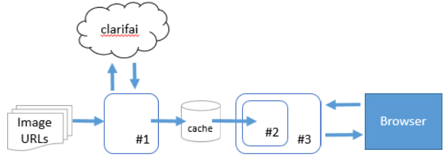
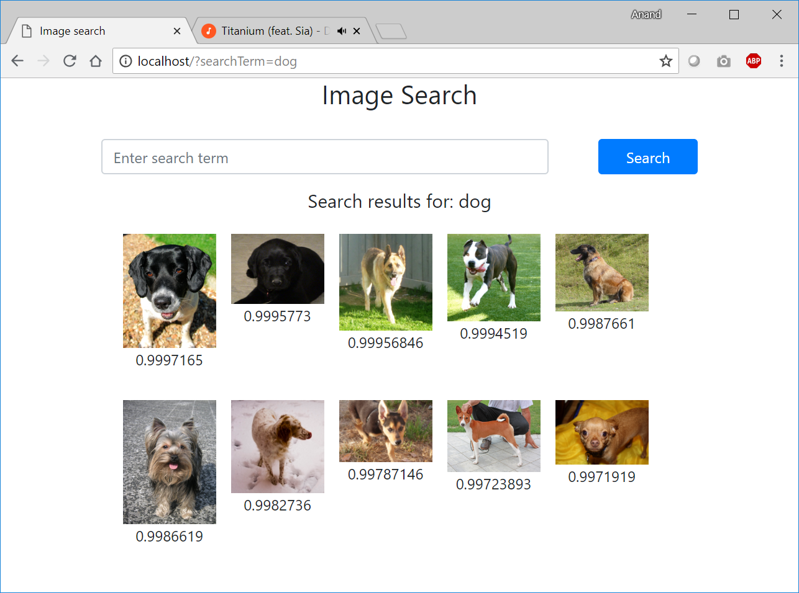
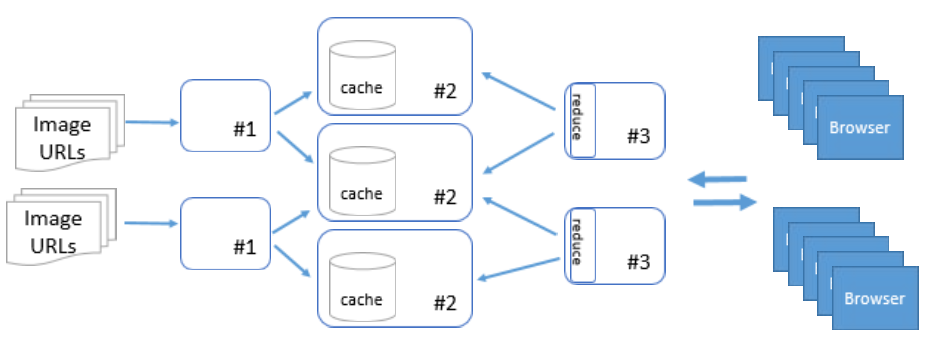

# Challenge

Design and implement an MVP that will:
 - Tag each image found in [this](./images.txt) file using the HTTP API (docs), and store the results in an in-memory data structure. Note: Do not use the search function of the API; you should only need to use the predict endpoint in your solution.
 - Provide a very simple interface (e.g. read from STDIN, html page with search box, or GUI) that repeatedly reads in a string tag name and returns a sorted list of at most 10 of the most probable images.

# Solution: MVP level-1
The solution is implemented as three services, that could be run as separate processes on multiple machines, or within a single process.



1. Image tagging service
2. Search service
3. Search web server

This MVP level 1 solution is meant to run on a single server.

### Image tagging service
Classifies images and caches classification results on disk. Since calls to classification APIs are expensive, caching the results is required to minimize API calls to one per image.

Cached data is a map of image URL to array of tags.
```
URL -> [  
    {term, score},
    {term, score}, ...
]
```

### Search service
Cached classification results are loaded into memory and converted into a concordance.

```
term -> [
    {URL, score},
    {URL, score},...
]
```

### Search web server
A web interface allows users to enter a term to search for. The term is looked up against the corcodance to return matching results.

### Output


# Solution: MVP-2

### Biggest limitation of MVP-1
Searching is limited to exact string matching of search terms. For example, a search for 'feline' would not retrieve results of cats.

### Word embeddings
Instead of matching terms exactly, we can convert classification results into word embeddings (vector of numbers, say 512 long) using libraries like word2vec.
User's search term too is mapped to a work embedding.

Word embeddings in the cache within a certain 'distance' of the search term's embedding would give us better results.

This would work even if the exact search term is not present in the cache.
For example: 'canine' and 'bovine' would pull up all results of 'dog' and 'cow' respectively.

Using matrix math on GPUs, the distance calculations can be batched, returning sub-second results.

### Scaling up

The three services could be split up to run as distributed services on multiple servers.



Map-reduce could be used to aggregate results from multiple servers.

Publish-subscribe could be used to keep the services updated when new data becomes available.

# Steps to run
Pre-requisites
- Install [golang](https://golang.org/) version 1.10.3

**Executing Search**

From terminal, run

 ```
 go run search.go
 ```

_Note: use argument -port nnnn to change default port (default: 80)_

Open browser to http://localhost/ and enter  a search term to view results.

**Running classification**

This step is necessary to recreate classification results file on disk.

From terminal, run

 ```
 go run classify.go -in ./images.txt -out ./cache.json
 ```
